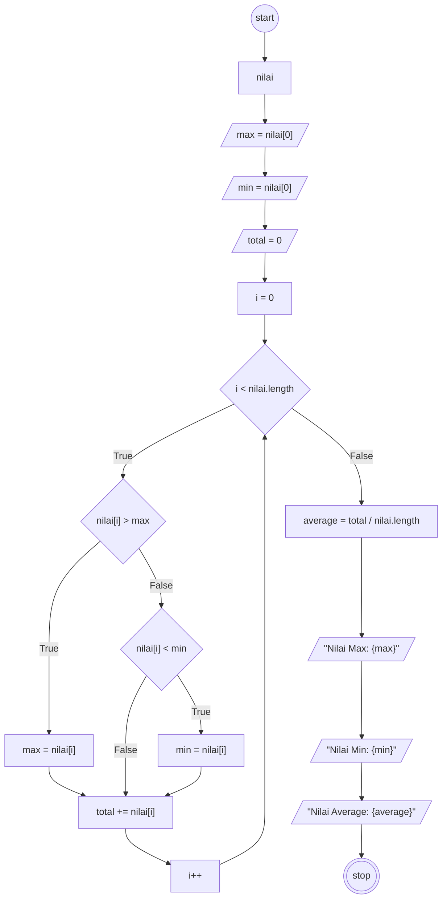

# Javascript 2

## Flowchart Program Hitung Nilai Max, Min, dan Average

Membuat Flowchart untuk program hitung nilai dengan proses max, min, dan average

```mermaid
    flowchart TD

    a@{shape: circle, label: "start"}
    b@{shape: rect, label: "nilai" }
    c@{shape: lean-r, label: "max = nilai[0]"}
    d@{shape: lean-r, label: "min = nilai[0]"}
    e@{shape: lean-r, label: "total = 0"}
    f@{shape: rect, label: "i = 0" }
    g@{shape: diamond, label: "i < nilai.length"}
    h@{shape: diamond, label: "nilai[i] > max"}
    i@{shape: rect, label: 'max = nilai[i]'}
    j@{shape: diamond, label: "nilai[i] < min"}
    k@{shape: rect, label: "min = nilai[i]"}
    l@{shape: rect, label: "total += nilai[i]"}
    r@{shape: rect, label: "i++"}

    m@{shape: rect, label: "average = total / nilai.length" }
    n@{shape: lean-r, label: '"Nilai Max: {max}"'}
    q@{shape: lean-r, label: '"Nilai Min: {min}"'}
    p@{shape: lean-r, label: '"Nilai Average: {average}"'}
    z@{shape: dbl-circ, label: "stop"}


    a-->b-->c-->d-->e-->f-->g
    g--True-->h
    h--True-->i-->l
    h--False-->j
    j--False-->l
    j--True-->k-->l
    l-->r-->g

    g--False-->m-->n-->q-->p-->z
```
